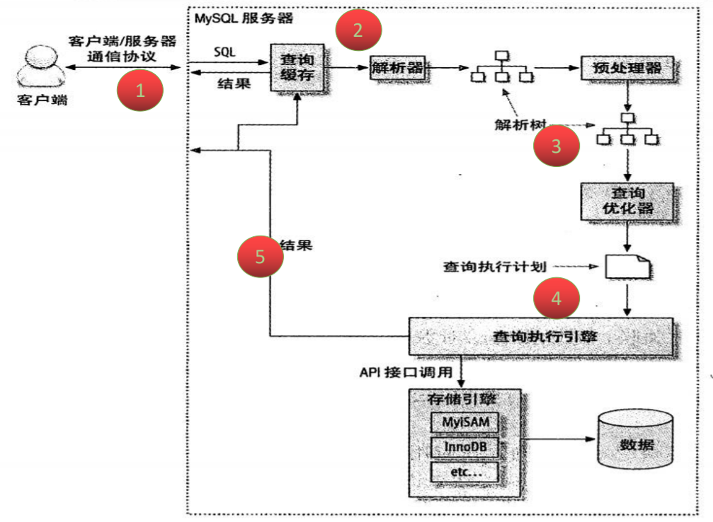
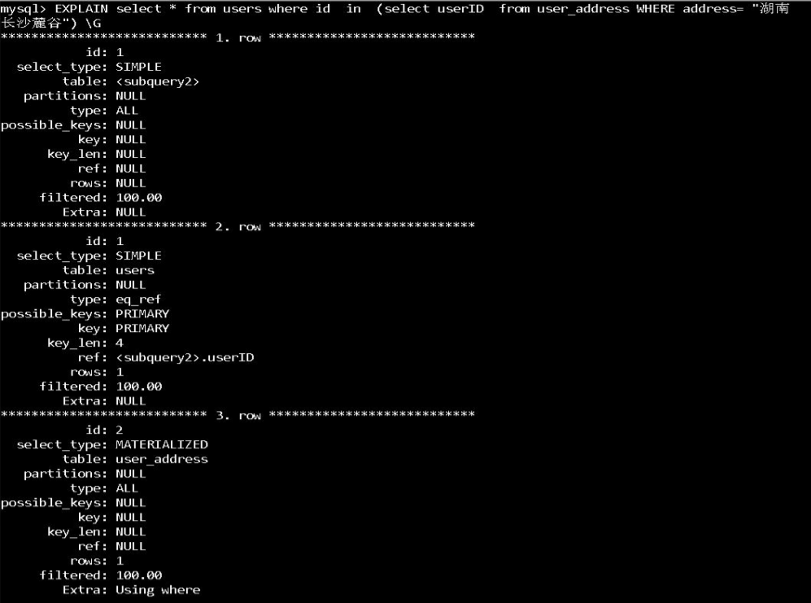

# Mysql

## destination

[TOC]

## 基础

### MySql 体系结构


1. Client Connectors
   接入方 支持协议很多
2. Management Serveices & Utilities
   系统管理和控制工具，mysqldump、 mysql复制集群、分区管理等
3. Connection Pool
   连接池：管理缓冲用户连接、用户名、密码、权限校验、线程处理等需要缓存的需求
4. SQL Interface
   SQL接口：接受用户的SQL命令，并且返回用户需要查询的结果
5. Parser
   解析器，SQL命令传递到解析器的时候会被解析器验证和解析。解析器是由Lex和YACC实现的
6. Optimizer
   查询优化器，SQL语句在查询之前会使用查询优化器对查询进行优化
7. Cache和Buffer（高速缓存区）
   查询缓存，如果查询缓存有命中的查询结果，查询语句就可以直接去查询缓存中取数据
8. pluggable storage Engines
   插件式存储引擎。存储引擎是MySql中具体的与文件打交道的子系统
9. file system
   文件系统，数据、日志（redo，undo）、索引、错误日志、查询记录、慢查询等

### Mysql 存储结构B+Tree

1. 为什么选择B+Tree
   1. 平衡二叉查找树(Balanced binary search tree)
      - 太深 : 每个节点只有两个分支导致树的深度太深, 深度决定着他的IO操作次数，IO操作耗时大.
      - 太小 : 每一个磁盘块（节点/页）保存的数据量太小了, 没有很好的利用操作磁盘IO的数据交换特性，也没有利用好磁盘IO的预读能力（空间局部性原理），从而带来频繁的IO操作.
   2. 多路平衡查找树(B-Tree)
   
2. B+Tree在两大引擎中如何体现
3. 索引知识补充
4. 总结及验证

### Mysql 存储引擎

   1，插拔式的插件方式
   2，存储引擎是指定在表之上的，即一个库中的每一个表都可以指定专用的存储引擎。
   3，不管表采用什么样的存储引擎，都会在数据区，产生对应的一个frm文件（表结构定义描述文件）

## MySQL查询优化详解

### 执行过程



1. mysql 客户端/服务端通信
2. 查询缓存
3. 查询优化处理
4. 查询执行引擎
5. 返回客户端

### Mysql半双工通信

特点
   客户端一旦开始发送消息，另一端要接收完整个消息才能响应。
   客户端一旦开始接收数据没法停下来发送指令。

### Mysql 通信状态


### Mysql 查询缓存

Mysql 查询缓存浪费计算资源, 有很多额外消耗, 缓存建议用外部中间件, redis等取代

当然若是以读为主的业务，数据生成之后就不常改变的业务, 可以考虑Mysql缓存

### Mysql 查询优化

查询优化处理的三个阶段：

1. 解析sql
   通过lex词法分析,yacc语法分析将sql语句解析成解析树
   https://www.ibm.com/developerworks/cn/linux/sdk/lex/
2. 预处理阶段
   根据mysql的语法的规则进一步检查解析树的合法性，如：检查数据的表
   和列是否存在，解析名字和别名的设置。还会进行权限的验证
3. 查询优化器
   优化器的主要作用就是找到最优的执行计划, Mysql的查询优化器是基于成本计算的原则。他会尝试各种执行计划。数据抽样的方式进行试验（随机的读取一个4K的数据块进行分析）

#### 查询优化器优化方式

1. 使用等价变化规则
   5 = 5 and a > 5 改写成 a > 5
   a < b and a = 5 改写成 b > 5 and a = 5
2. 基于联合索引，调整条件位置等
3. 优化count 、min、max等函数
   min函数只需找索引最左边
   max函数只需找索引最右边
   myisam引擎count(*)
4. 覆盖索引扫描
5. 子查询优化
6. 提前终止查询
   用了limit关键字或者使用不存在的条件
7. IN的优化
   先进性排序，再采用二分查找的方式

### 执行计划

#### 示例



```shell
           id: 1
  select_type: SIMPLE
        table: student
   partitions: NULL
         type: ALL
possible_keys: NULL
          key: NULL
      key_len: NULL
          ref: NULL
         rows: 62
     filtered: 100.00
        Extra: NULL
```

#### 执行计划 属性

Id
   select查询的序列号，标识执行的顺序
   1.id相同，执行顺序由上至下
   2.id不同，如果是子查询，id的序号会递增，id值越大优先级越高，越先被执行
   3.id相同又不同即两种情况同时存在，id如果相同，可以认为是一组，从上往下顺序执行；在所有组中，id值越大，优先级越高，越先执行
table
   查询涉及到的表
   1. 直接显示表名或者表的别名
   2. \<unionM,N\>  : 由ID为M,N 查询union产生的结果
   3. \<subqueryN\> : 由ID为N查询生产的结果

possible_keys
   查询过程中有可能用到的索引
key
   实际使用的索引，如果为NULL，则没有使用索引 rows, 根据表统计信息或者索引选用情况，大致估算出找到所需的记录所需要读取的行数
filtered
   它指返回结果的行占需要读到的行(rows列的值)的百分比, 表示返回结果的行数占需读取行数的百分比，filtered的值越大越好

##### select_type

查询的类型，主要是用于区分普通查询、联合查询、子查询等

select Type | means
-|-
SIMPLE | 简单的select查询，查询中不包含子查询或者union
PRIMARY | 查询中包含子部分，最外层查询则被标记为primary
SUBQUERY | SUBQUERY表示在select 或 where列表中包含了子查询
MATERIALIZED | 表示where 后面in条件的子查询
UNION | 若第二个select出现在union之后，则被标记为union
UNION RESULT | 从union表获取结果的select

##### type

访问类型，sql查询优化中一个很重要的指标，结果值从好到坏依次是：
`system > const > eq_ref > ref > range > index > ALL`

type | means
-|-
system | 表只有一行记录（等于系统表），const类型的特例，基本不会出现，可以忽略不计
const | 表示通过索引一次就找到了，const 用于比较 primary key 或者 unique 索引
eq_ref | 唯一索引扫描，对于每个索引键，表中只有一条记录与之匹配。常见于主键 或 唯一索引扫描
ref | 非唯一性索引扫描，返回匹配某个单独值的所有行，本质是也是一种索引访问
range | 只检索给定范围的行，使用一个索引来选择行
index | Full Index Scan，索引全表扫描，把索引从头到尾扫一遍
ALL | Full Table Scan，遍历全表以找到匹配的行

1. const 示例
   > SELECT * FROM tbl_name WHERE primary_key=1;
   >
   > SELECT * FROM tbl_name WHERE primary_key_part1=1 AND primary_key_part2=2;
2. eq_ref 示例
   读取本表中和关联表表中的每行组合成的一行。除 了 system 和 const 类型之外, 这是最好的联接类型。当连接使用索引的所有部分时, 索引是主键或唯一非 NULL 索引时, 将使用该值。
   eq_ref 可用于使用 = 运算符比较的索引列。比较值可以是常量或使用此表之前读取的表中的列的表达式。在下面的示例中, MySQL 可以使用 eq_ref 连接(join)ref_table来处理:

   ```sql
   SELECT * FROM ref_table,other_table WHERE ref_table.key_column=other_table.column;

   SELECT * FROM ref_table,other_table WHERE ref_table.key_column_part1=other_table.column AND ref_table.key_column_part2=1;
   ```

3. ref
   对于每个来自于前面的表的行组合，所有有匹配索引值的行将从这张表中读取。如果联接只使用键的最左边的前缀，或如果键不是UNIQUE或PRIMARY KEY（换句话说，如果联接不能基于关键字选择单个行的话），则使用ref。如果使用的键仅仅匹配少量行，该联接类型是不错的。
4. ref_or_null
   该联接类型如同ref，但是添加了MySQL可以专门搜索包含NULL值的行。在解决子查询中经常使用该联接类型的优化。

十分重要的额外信息
1、Using filesort ：
mysql对数据使用一个外部的文件内容进行了排序，而不是按照表内的索引进行排序读取
2、Using temporary：
使用临时表保存中间结果，也就是说mysql在对查询结果排序时使用了临时表，常见于order by 或 group by
3、Using index：
表示相应的select操作中使用了覆盖索引（Covering Index），避免了访问表的数据行，效率高
4、Using where ：
使用了where过滤条件
5、select tables optimized away：
基于索引优化MIN/MAX操作或者MyISAM存储引擎优化COUNT(*)操作，不必等到执行阶段在进行计算，查询执行
计划生成的阶段即可完成优化
做技术人的指路明灯,做职场生涯的精神导师 咕泡学院官网:http://www.gupaoedu.com
调用插件式的存储引擎的原子API的功能进行执行计划的执行

## MVCC

[MySQL中InnoDB的多版本并发控制(MVCC)](https://www.jianshu.com/p/a3d49f7507ff)

MVCC（Multi-Version Concurrency Control）即多版本并发控制。
MySQL的大多数事务型（如InnoDB,Falcon等）存储引擎实现的都不是简单的行级锁。基于提升并发性能的考虑，他们一般都同时实现了MVCC。当前不仅仅是MySQL,其它数据库系统（如Oracle, PostgreSQL）也都实现了MVCC。值得注意的是MVCC并没有一个统一的实现标准，所以不同的数据库，不同的存储引擎的实现都不尽相同。

MVCC只在 READ COMMITED 和 REPEATABLE READ 两个隔离级别下工作。READ UNCOMMITTED总是读取最新的数据行，而不是符合当前事务版本的数据行。而SERIALIZABLE 则会对所有读取的行都加锁

优点 : MVCC在大多数情况下代替了行锁，实现了对读的非阻塞，读不加锁，读写不冲突。
缺点 : 每行记录都需要额外的存储空间，需要做更多的行维护和检查工作。

### Innodb中的隐藏列

Innodb通过undo log保存了已更改行的旧版本的信息的快照。
InnoDB的内部实现中为每一行数据增加了三个隐藏列用于实现MVCC。

列名 | 长度(字节) | 作用
-|-|-
DB_TRX_ID | 6 | 插入或更新行的最后一个事务的事务标识符。（删除视为更新，将其标记为已删除）
DB_ROLL_PTR | 7 | 写入回滚段的撤消日志记录（若行已更新，则撤消日志记录包含在更新行之前重建行内容所需的信息）
DB_ROW_ID | 6 | 行标识（隐藏单调自增id）

操作 :

1. INSERT
   将 新增的数据的 DB_TRX_ID 赋值为当前事务版本号
2. DELETE
   将 删除的数据的 DB_ROLL_PTR 赋值为当前事务版本号
3. UPDATE
   同时执行上面两条, 增加新记录, 标记旧纪录.
   将新记录的 DB_TRX_ID 赋值为 当前事务版本号, 将旧纪录的数据 的 DB_ROLL_PTR 赋值为 当前事务版本号
4. SELECT
   InnoDB 会根据两个条件来检查每行记录：
   InnoDB只查找 DB_TRX_ID 早于当前事务版本的数据行, 以及 DB_ROLL_PTR 为空或大于当前事务版本的数据行


