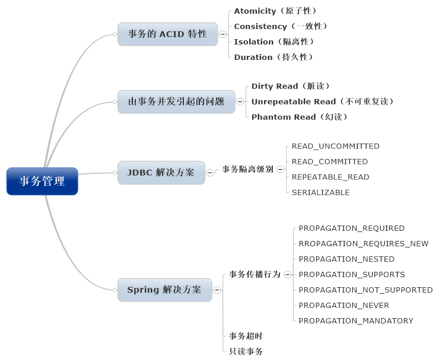

#### 事物的ACID特性
   原子性是基础，隔离性是手段，持久性是目的，真正的老大就是一致性。
   1. 原子性（Atomicity）
      事务必须是一个不可分割的整体，要么做完，要么就不做。
   2. 一致性（Consistency）
      执行完数据库操作后，前后保持一致，数据不会被破坏。
   3. 隔离性（Isolation）
   4. 持久性（Duration）

#### 由事物并发引发的问题
   1. Dirty Read（脏读）
      脏读发生在一个事务读取了另一个事务改写但尚未提交的数据时。如果改写在稍后被回滚了，那么第一个事务获取的数据就是无效的。
   2. Unrepeatable（不可重复读）
      不可重复读发生在一个事务执行相同的查询两次或两次以上，但是每次都得到不同的数据时。这通常是因为另一个并发事务在两次查询期间进行了更新。
   3. Phantom Read（幻读）
      幻读与不可重复读类似。它发生在一个事务（T1）读取了几行数据，接着另一个并发事务（T2）插入了一些数据时。在随后的查询中，第一个事务（T1）就会发现多了一些原本不存在的记录。

 >**不可重复读与幻读的区别**
      不可重复读的重点是修改: 同样的条件, 你读取过的数据, 再次读取出来发现值不一样了。
      幻读的重点在于新增或者删除：同样的条件, 第1次和第2次读出来的记录数不一样。
      从总的结果来看, 似乎不可重复读和幻读都表现为两次读取的结果不一致。但如果你从控制的角度来看, 两者的区别就比较大。对于前者, 只需要锁住满足条件的记录。对于后者, 要锁住满足条件及其相近的记录。

#### JDBC解决方案
   - 事务隔离级别
      1. READ_UNCOMMITTED
      2. READ_COMMITTED
      3. REPEATABLE_READ
      4. SERIALIZABLE

#### Spring解决方案
   - 事务传播行为
      事务传播行为用来描述由某一个事务传播行为修饰的方法被嵌套进另一个方法的时事务如何传播。

传播行为 | 含义
-|-
PROPAGATION_REQUIRED | 表示当前方法必须运行在事务中。如果当前事务存在，方法将会在该事务中运行。否则，会启动一个新的事务
PROPAGATION_SUPPORTS | 表示当前方法不需要事务上下文，但是如果存在当前事务的话，那么该方法会在这个事务中运行
PROPAGATION_MANDATORY | 表示该方法必须在事务中运行，如果当前事务不存在，则会抛出一个异常
PROPAGATION_REQUIRED_NEW | 表示当前方法必须运行在它自己的事务中。一个新的事务将被启动。如果存在当前事务，在该方法执行期间，当前事务会被挂起。如果使用JTATransactionManager的话，则需要访问TransactionManager
PROPAGATION_NOT_SUPPORTED | 表示该方法不应该运行在事务中。如果存在当前事务，在该方法运行期间，当前事务将被挂起。如果使用JTATransactionManager的话，则需要访问TransactionManager
PROPAGATION_NEVER | 表示当前方法不应该运行在事务上下文中。如果当前正有一个事务在运行，则会抛出异常
PROPAGATION_NESTED | 表示如果当前已经存在一个事务，那么该方法将会在嵌套事务中运行。嵌套的事务可以独立于当前事务进行单独地提交或回滚。如果当前事务不存在，那么其行为与PROPAGATION_REQUIRED一样。注意各厂商对这种传播行为的支持是有所差异的。可以参考资源管理器的文档来确认它们是否支持嵌套事务

   - 事物超时（Transaction Timeout）：为了解决事务时间太长，消耗太多的资源，所以故意给事务设置一个最大时常，如果超过了，就回滚事务。
   - 只读事务（Readonly Transaction）：为了忽略那些不需要事务的方法，比如读取数据，这样可以有效地提高一些性能。
