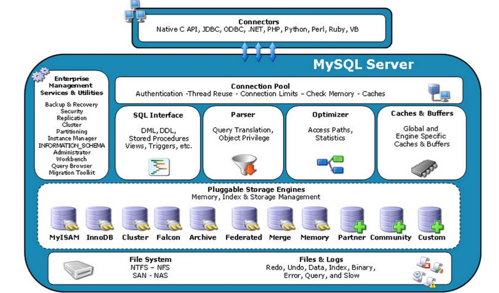
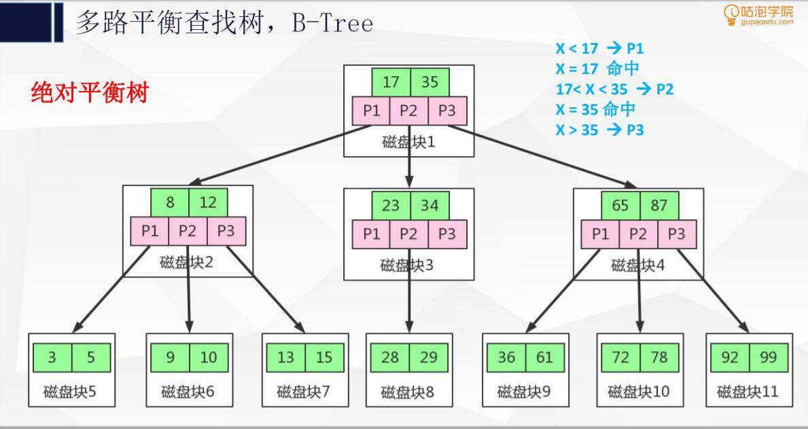

### MySql

2. 为什么选择B+Tree
   1. 平衡二叉查找树(Balanced binary search tree)
      - 太深 : 每个节点只有两个分支导致树的深度太深, 深度决定着他的IO操作次数，IO操作耗时大.
      - 太小 : 每一个磁盘块（节点/页）保存的数据量太小了, 没有很好的利用操作磁盘IO的数据交换特性，也没有利用好磁盘IO的预读能力（空间局部性原理），从而带来频繁的IO操作.
   2. 多路平衡查找树(B-Tree)
   

4. B+Tree在两大引擎中如何体现
5. 索引知识补充
6. 总结及验证

#### [MySQL两种存储引擎: MyISAM和InnoDB 简单总结](https://www.cnblogs.com/kevingrace/p/5685355.html)
MyISAM性能极佳，但却有一个缺点：不支持事务处理（transaction）。InnoDB（另一种数据库引擎），以强化参考完整性与并发违规处理机制，逐渐取代MyISAM。与传统的ISAM与MyISAM相比，InnoDB的最大特色就是支持了ACID兼容的事务（Transaction）功能，类似于PostgreSQL。
>MyISAM和InnoDB两者之间有着明显区别，简单梳理如下:
   1. 事务支持
   MyISAM不支持事务，而InnoDB支持。InnoDB的AUTOCOMMIT默认是打开的，即每条SQL语句会默认被封装成一个事务，自动提交，这样会影响速度，所以最好是把多条SQL语句显示放在begin和commit之间，组成一个事务去提交。
   MyISAM是非事务安全型的，而InnoDB是事务安全型的，默认开启自动提交，宜合并事务，一同提交，减小数据库多次提交导致的开销，大大提高性能。
   2. 存储结构
   MyISAM：每个MyISAM在磁盘上存储成三个文件。第一个文件的名字以表的名字开始，扩展名指出文件类型。.frm文件存储表定义。数据文件的扩展名为.MYD (MYData)。索引文件的扩展名是.MYI (MYIndex)。
   InnoDB：所有的表都保存在同一个数据文件中（也可能是多个文件，或者是独立的表空间文件），InnoDB表的大小只受限于操作系统文件的大小，一般为2GB。
   3. 存储空间
   MyISAM：可被压缩，存储空间较小。支持三种不同的存储格式：静态表(默认，但是注意数据末尾不能有空格，会被去掉)、动态表、压缩表。
   InnoDB：需要更多的内存和存储，它会在主内存中建立其专用的缓冲池用于高速缓冲数据和索引。
   4. 可移植性、备份及恢复
   MyISAM：数据是以文件的形式存储，所以在跨平台的数据转移中会很方便。在备份和恢复时可单独针对某个表进行操作。
   InnoDB：免费的方案可以是拷贝数据文件、备份 binlog，或者用 mysqldump，在数据量达到几十G的时候就相对痛苦了。
   5. 事务支持
   MyISAM：强调的是性能，每次查询具有原子性,其执行数度比InnoDB类型更快，但是不提供事务支持。
   InnoDB：提供事务支持事务，外部键等高级数据库功能。 具有事务(commit)、回滚(rollback)和崩溃修复能力(crash recovery capabilities)的事务安全(transaction-safe (ACID compliant))型表。
   6. AUTO_INCREMENT
   MyISAM：可以和其他字段一起建立联合索引。引擎的自动增长列必须是索引，如果是组合索引，自动增长可以不是第一列，他可以根据前面几列进行排序后递增。
   InnoDB：InnoDB中必须包含只有该字段的索引。引擎的自动增长列必须是索引，如果是组合索引也必须是组合索引的第一列。
   7. 表锁差异
   MyISAM：只支持表级锁，用户在操作myisam表时，select，update，delete，insert语句都会给表自动加锁，如果加锁以后的表满足insert并发的情况下，可以在表的尾部插入新的数据。
   InnoDB：支持事务和行级锁，是innodb的最大特色。行锁大幅度提高了多用户并发操作的新能。但是InnoDB的行锁，只是在WHERE的主键是有效的，非主键的WHERE都会锁全表的。
   MyISAM锁的粒度是表级，而InnoDB支持行级锁定。简单来说就是, InnoDB支持数据行锁定，而MyISAM不支持行锁定，只支持锁定整个表。即MyISAM同一个表上的读锁和写锁是互斥的，MyISAM并发读写时如果等待队列中既有读请求又有写请求，默认写请求的优先级高，即使读请求先到，所以MyISAM不适合于有大量查询和修改并存的情况，那样查询进程会长时间阻塞。因为MyISAM是锁表，所以某项读操作比较耗时会使其他写进程饿死。
   8. 全文索引
   MyISAM：支持(FULLTEXT类型的)全文索引
   InnoDB：不支持(FULLTEXT类型的)全文索引，但是innodb可以使用sphinx插件支持全文索引，并且效果更好。
   全文索引是指对char、varchar和text中的每个词（停用词除外）建立倒排序索引。MyISAM的全文索引其实没啥用，因为它不支持中文分词，必须由使用者分词后加入空格再写到数据表里，而且少于4个汉字的词会和停用词一样被忽略掉。
   另外，MyIsam索引和数据分离，InnoDB在一起，MyIsam天生非聚簇索引，最多有一个unique的性质，InnoDB的数据文件本身就是主键索引文件，这样的索引被称为“聚簇索引”
   9. 表主键
   MyISAM：允许没有任何索引和主键的表存在，索引都是保存行的地址。
   InnoDB：如果没有设定主键或者非空唯一索引，就会自动生成一个6字节的主键(用户不可见)，数据是主索引的一部分，附加索引保存的是主索引的值。InnoDB的主键范围更大，最大是MyISAM的2倍。
   10. 表的具体行数
   MyISAM：保存有表的总行数，如果select count(\*) from table;会直接取出出该值。
   InnoDB：没有保存表的总行数(只能遍历)，如果使用select count(\*) from table；就会遍历整个表，消耗相当大，但是在加了wehre条件后，myisam和innodb处理的方式都一样。
   11. CURD操作
   MyISAM：如果执行大量的SELECT，MyISAM是更好的选择。
   InnoDB：如果你的数据执行大量的INSERT或UPDATE，出于性能方面的考虑，应该使用InnoDB表。DELETE 从性能上InnoDB更优，但DELETE FROM table时，InnoDB不会重新建立表，而是一行一行的删除，在innodb上如果要清空保存有大量数据的表，最好使用 truncate table这个命令。
   12. 外键
   MyISAM：不支持
   InnoDB：支持
   13. 查询效率
   没有where的count(\*)使用MyISAM要比InnoDB快得多。因为MyISAM内置了一个计数器，count(\*)时它直接从计数器中读，而InnoDB必须扫描全表。所以在InnoDB上执行count(\*)时一般要伴随where，且where中要包含主键以外的索引列。为什么这里特别强调“主键以外”？因为InnoDB中primary index是和raw data存放在一起的，而secondary index则是单独存放，然后有个指针指向primary key。所以只是count(\*)的话使用secondary index扫描更快，而primary key则主要在扫描索引同时要返回raw data时的作用较大。MyISAM相对简单，所以在效率上要优于InnoDB，小型应用可以考虑使用MyISAM。
   通过上述的分析，基本上可以考虑使用InnoDB来替代MyISAM引擎了，原因是InnoDB自身很多良好的特点，比如事务支持、存储 过程、视图、行级锁定等等，在并发很多的情况下，相信InnoDB的表现肯定要比MyISAM强很多。另外，任何一种表都不是万能的，只用恰当的针对业务类型来选择合适的表类型，才能最大的发挥MySQL的性能优势。如果不是很复杂的Web应用，非关键应用，还是可以继续考虑MyISAM的，这个具体情况可以自己斟酌。
   >---
   MyISAM和InnoDB两者的应用场景：
   1. MyISAM管理非事务表。它提供高速存储和检索，以及全文搜索能力。如果应用中需要执行大量的SELECT查询，那么MyISAM是更好的选择。
   2. InnoDB用于事务处理应用程序，具有众多特性，包括ACID事务支持。如果应用中需要执行大量的INSERT或UPDATE操作，则应该使用InnoDB，这样可以提高多用户并发操作的性能。
   >---
   但是实际场景中，针对具体问题需要具体分析，一般而言可以遵循以下几个问题：
   -  数据库是否有外键？
   -  是否需要事务支持？
   -  是否需要全文索引？
   -  数据库经常使用什么样的查询模式？在写多读少的应用中还是Innodb插入性能更稳定，在并发情况下也能基本，如果是对读取速度要求比较快的应用还是选MyISAM。
   -  数据库的数据有多大？ 大尺寸倾向于innodb，因为事务日志，故障恢复。
